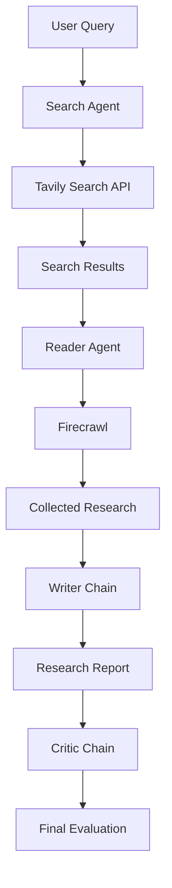
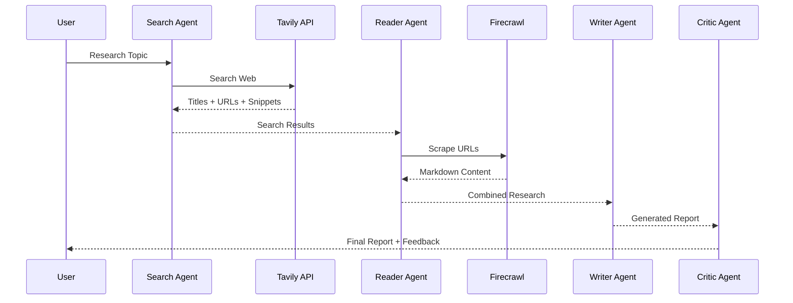

<!-- ========================================================= -->
<!--                  MULTI AGENT RESEARCH SYSTEM               -->
<!-- ========================================================= -->


# 🚀 Multi-Agent Research System

### Enterprise AI Research Assistant powered by Multi-Agent Architecture, Google Gemini, LangChain, Tavily & Firecrawl


<br>


---

# 🌍 Overview

The **Multi-Agent Research System** is an enterprise-inspired AI application that automates the complete research workflow using specialized AI agents.

Instead of relying on a single LLM response, the system follows a structured pipeline where each agent performs a dedicated responsibility—from searching the web and extracting knowledge to generating and reviewing professional research reports.

The architecture is modular, scalable, and designed to resemble real-world enterprise AI systems.

---

# ✨ Key Features

- 🔍 AI Powered Web Search
- 🌐 Real-time Information Retrieval
- 📄 Intelligent Web Scraping
- 🤖 Multi-Agent Collaboration
- ✍️ AI Research Report Generation
- 🧐 AI Quality Review (Critic Agent)
- 📚 Automatic Research Compilation
- 📑 Markdown Report Generation
- ⚡ Modular Python Architecture
- 🧩 Easily Extendable Pipeline

---

# 🏗️ System Architecture

```text
                    User Query
                         │
                         ▼
                🔍 Search Agent
                         │
                         ▼
                🌐 Tavily Search
                         │
                         ▼
          Search Results (Title, URL, Snippet)
                         │
                         ▼
                📖 Reader Agent
                         │
                         ▼
              🔥 Firecrawl Scraper
                         │
                         ▼
              Structured Research Data
                         │
                         ▼
               ✍️ Writer Chain
                         │
                         ▼
         Professional Research Report
                         │
                         ▼
               🧐 Critic Chain
                         │
                         ▼
         Report Evaluation & Feedback
```

---

# ⚙️ Workflow



---

# 🛠️ Core Technologies

| Category | Technology |
|----------|------------|
| Language | Python |
| LLM | Google Gemini 2.5 Flash |
| Framework | LangChain |
| Search Engine | Tavily Search API |
| Web Scraping | Firecrawl |
| Prompting | Prompt Engineering |
| Architecture | Multi-Agent System |
| Reports | Markdown |
| Environment | dotenv |

---

# 🚀 Tech Stack

| Category | Technology |
|-----------|------------|
| Programming Language | Python 3.10+ |
| Large Language Model | Google Gemini 2.5 Flash |
| AI Framework | LangChain |
| Agent Framework | LangChain Agents |
| Web Search | Tavily Search API |
| Web Scraping | Firecrawl |
| Prompt Engineering | LangChain Prompt Templates |
| Output Parsing | StrOutputParser |
| Environment Management | python-dotenv |
| Terminal UI | Rich |
| Data Format | Markdown |

---

# 📂 Project Structure

```text
Multi-Agent-Research-System
│
├── outputs/
│   ├── report.md
│   └── feedback.md
│
├── agents.py
├── pipeline.py
├── tools.py
├── schemas.py
├── app.py
├── requirements.txt
├── README.md
├── LICENSE
├── .gitignore
└── .env
```

---

# ⚡ Installation

## 1️⃣ Clone Repository

```bash
git clone https://github.com/YOUR_USERNAME/Multi-Agent-Research-System.git
```

```bash
cd Multi-Agent-Research-System
```

---

## 2️⃣ Create Virtual Environment

### Windows

```bash
python -m venv .venv
```

Activate

```bash
.venv\Scripts\activate
```

---

### Linux / macOS

```bash
python3 -m venv .venv
```

Activate

```bash
source .venv/bin/activate
```

---

## 3️⃣ Install Dependencies

```bash
pip install -r requirements.txt
```

---

# 🔑 Environment Variables

Create a **.env** file in the root directory.

```env
GOOGLE_API_KEY=YOUR_GEMINI_API_KEY

TAVILY_API_KEY=YOUR_TAVILY_API_KEY

FIRECRAWL_API_KEY=YOUR_FIRECRAWL_API_KEY
```

---

# ▶️ Running the Project

```bash
python pipeline.py
```

Enter your research topic

```text
Enter Research Topic:

Future of Artificial Intelligence
```

---

# 📊 Pipeline Execution

```text
🚀 Research Pipeline Started

↓

🔍 Search Agent

↓

🌐 Tavily Search

↓

📑 Search Results

↓

📖 Reader Agent

↓

🔥 Firecrawl

↓

🧠 Combined Research

↓

✍️ Writer Chain

↓

🧐 Critic Chain

↓

💾 Save Report

↓

✅ Completed
```

---

# 📸 Sample Output

```text
========================================================

🔍 STEP 1 : SEARCH AGENT

========================================================

Searching latest information...

✔ Search Completed

========================================================

📖 STEP 2 : READER AGENT

========================================================

Scraping webpages...

✔ Reading Completed

========================================================

✍️ STEP 3 : WRITER

========================================================

Generating Professional Report...

✔ Report Generated

========================================================

🧐 STEP 4 : CRITIC

========================================================

Reviewing Report...

✔ Review Completed

========================================================

🎉 PIPELINE FINISHED

========================================================
```

---

# 📑 Generated Outputs

After execution, the project automatically generates:

```text
outputs/

├── report.md

└── feedback.md
```

---

# 🌟 Highlights

- 🤖 Multi-Agent Workflow
- 🌐 Real-Time Web Research
- 🔥 Firecrawl Web Scraping
- 📝 Automated Report Generation
- 📊 AI Report Evaluation
- ⚡ Modular Architecture
- 🧩 Easily Extendable
- 🏗️ Enterprise-Inspired Design

---
# 🤖 AI Agents

This project follows an **Enterprise Multi-Agent Architecture**, where each AI agent has a dedicated responsibility in the research pipeline.

| Agent | Responsibility |
|--------|---------------|
| 🔍 Search Agent | Searches the internet using Tavily API |
| 📖 Reader Agent | Reads and extracts useful webpage content using Firecrawl |
| ✍️ Writer Agent | Generates professional research reports |
| 🧐 Critic Agent | Reviews the report and provides constructive feedback |

---

# 🔄 Sequence Diagram



---

# 🧠 Skills Demonstrated

### Artificial Intelligence

- Multi-Agent Systems
- Agentic AI
- LLM Applications
- Prompt Engineering
- AI Workflow Design

### Backend Development

- Python
- Modular Programming
- API Integration
- Environment Variables

### AI Tools

- LangChain
- Google Gemini
- Tavily Search
- Firecrawl

### Software Engineering

- Clean Architecture
- Pipeline Design
- Error Handling
- Modular Code
- Scalable Project Structure

---

# 🎯 Future Improvements

- [ ] Streamlit Dashboard
- [ ] PDF Report Export
- [ ] DOCX Export
- [ ] Async Processing
- [ ] Multi-source Research
- [ ] Memory Module
- [ ] Citation Verification
- [ ] Research History
- [ ] Docker Deployment
- [ ] Cloud Deployment
- [ ] User Authentication
- [ ] Enterprise RAG Integration

---

# 🏆 Project Highlights

- ✅ Enterprise Multi-Agent Architecture
- ✅ Real-Time AI Research
- ✅ Autonomous Web Search
- ✅ Intelligent Web Scraping
- ✅ AI Report Writing
- ✅ AI Report Reviewing
- ✅ Modular Python Design
- ✅ Production-Style Workflow
- ✅ Easily Scalable
- ✅ Open Source Friendly

---

# 🤝 Connect With Me

<p align="center">

<a href="https://github.com/https://github.com/devav-02">

</a>

<a href="https://www.linkedin.com/in/https://www.linkedin.com/in/abhishek-vishwakarma-86649b30b//">

</a>

<a href="mailto:av973517@gmail.com">

</a>

</p>

---

# ⭐ Support

If you found this project useful, consider giving it a ⭐ on GitHub.

It motivates me to build more open-source AI projects.

---

<div align="center">

## 🚀 Building Intelligent AI Systems One Project at a Time

### Thanks for visiting ❤️


</div>
